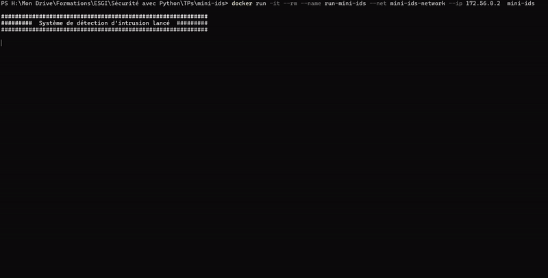

# Système de Détection d'Intrusion (Mini IDS)

Ce programme est un système de détection d'intrusion minimaliste qui surveille les journaux système et les nouvelles connexions réseau pour détecter les activités suspectes.

## Compatibilité du Système d'Exploitation

Le programme est compatible avec les systèmes d'exploitation Linux. Il nécessite que les services suivants soient activés sur le système :
- Service SSH pour la surveillance des connexions SSH
- Service syslog pour la surveillance des journaux système

À noter : Le programme a été testé uniquement sur l'environnement Docker basé sur une image python:3-bookworm conçu à cet effet.

## Instructions d'Installation et d'Exécution

### Prérequis
- Python 3.6 ou supérieur
- OS : Linux
- Service SSH lancé
- Service syslog lancé
- Docker (Pour l'éxécution du conteneur via Dockerfile)

### Installation / Exécution

#### Docker
1. Cloner le repository :
   ```bash
   git clone https://github.com/LNono7/mini-ids.git
   ```
2. Accéder au répertoire du projet :
   ```bash
   cd mini-ids
   ```
3. Construisez l'image Docker :
   ```bash
   docker build -t mini-ids .
   ```
4. Créez un réseau Docker :
   ```bash
   docker network create --subnet=172.56.0.0/24 mini-ids-network
   ```
5. Exécutez le conteneur depuis l'image Docker construite :
   ```bash
   docker run -it --rm --name run-mini-ids --net mini-ids-network --ip 172.56.0.2 mini-ids
   ```
#### Linux
1. Cloner le repository :
   ```bash
   git clone https://github.com/LNono7/mini-ids.git
   ```
2. Accéder au répertoire du projet :
   ```bash
   cd mini-ids
   ```
3. Créer un environnement virtuel :
   ```bash
   python3 -m venv venv
   source venv/bin/activate
   ```
4. Installer les dépendances :
   ```bash
   pip install -r app/requirements.txt
   ```
5. Exécuter le programme directement :
   ```bash
   python app/main.py
   ```

## Utilisation / Exemple

Après avoir lancé Mini IDS, il commencera à surveiller les journaux système et les ports réseau pour détecter toute activité suspecte.

### Détections du programme

Voici les détails des détections effectuées par le programme :

1. Information sur l'OS
- Explication : Détecte le système d'exploitation sur lequel le programme est exécuté.
- Exemple de Résultat : [INFO] Système d'exploitation détecté : <nom_de_l'OS\>

2. Installation des Dépendances
- Explication : Installe les dépendances nécessaires au fonctionnement du programme selon l'OS.
- Exemple : Environnement Docker Debian 12, Lance le service SSH, rsyslogd et créer le fichier authorized_keys pour le /root.

3. Détection d'un Nouvel Utilisateur / Groupe
- Explication : Détecte la création d'un nouvel utilisateur ou d'un nouveau groupe sur le système.
- Test : Créez manuellement un nouvel utilisateur ou groupe via la commande `useradd `ou `groupadd`.
- Exemple de Résultat : [INFO] Nouvel utilisateur créé : <username\> (UID=<uid\>, GID=<gid\>)

4. Détection des Ajouts d'Utilisateurs dans un Groupe
- Explication : Détecte lorsqu'un utilisateur est ajouté à un groupe existant.
- Test : Ajoutez manuellement un utilisateur à un groupe avec la commande `usermod`.
- Exemple de Résultat : [INFO] Utilisateur \<username\> ajouté au groupe <groupname\>

5. Détection des Changements de Mot de Passe Utilisateur
- Explication : Détecte lorsque le mot de passe d'un utilisateur est modifié.
- Test : Changez manuellement le mot de passe d'un utilisateur via la commande `passwd`.
- Exemple de Résultat : [INFO] Changement de mot de passe pour l'utilisateur : <username\>

6. Connexion Utilisateurs
- Explication : Détecte une connexion réussie d'un utilisateur.
- Test : Connectez-vous avec succès au système avec la commande `su`.
- Exemple de Résultat : [INFO] Connexion réussie de l'utilisateur : <username\>

7. Ajout d'une Clé SSH
- Explication : Détecte l'ajout d'une nouvelle clé SSH pour l'utilisateur root.
- Test : Ajoutez manuellement une nouvelle clé SSH dans le fichier authorized_keys de l'utilisateur root.
Exemple de Résultat : [ALERT] Nouvelle clé SSH ajoutée pour l'utilisateur root

8. Connexions SSH
- Explication : Détecte les tentatives de connexion SSH, qu'elles réussissent ou échouent.
- Test : Tentez de vous connecter au système via SSH.
- Exemple de Résultat (échec) : [WARNING] Tentative de connexion SSH échouée pour <username\>

9. IP Blacklist (IPV4/IPV6)
- Explication : Détecte les connexions réseau refusées provenant d'une adresse IP blacklistée.
- Test : Tentez de vous connecter au système depuis une adresse IP blacklistée dans /etc/hosts.deny.
- Exemple de Résultat : [WARNING] Connexion refusée depuis l'adresse IP <source_ip\>

10. Détection de Brute Force
- Explication : Détecte les tentatives de connexion SSH répétées échouées depuis une même adresse IP.
- Test : Effectuez plusieurs tentatives de connexion SSH échouées depuis une même adresse IP.
- Exemple de Résultat : [ALERT] Tentative de brute force SSH détectée depuis <source_ip\>

11. Ouverture d'un Port en Écoute
- Explication : Détecte l'ouverture d'un nouveau port en écoute sur le système.
- Test : Ouvrez un nouveau port en écoute sur la machine via la commande nc.
- Exemple de Résultat : [ALERT] Nouveaux ports ouverts détectés : <port\>

### Exemple

Le programme va lancer le script bash `trigger_ids.bash` automatiquement qui va permettre d'afficher toutes les détections possible mis à part `IP Blacklist`

Le programme continuera à fonctionner ensuite pour éventuellement faire d'autres tests supplémentaires, `CTRL + C ` pour mettre fin au programme.

Pour tester rapidement la détection `IP Blacklist`, il est possible d'exécuter un autre conteneur via cette commande dans le même réseau précedemment créé :

   ```bash
   docker run -it --rm --name run-mini-ids-test --net mini-ids-network --ip 172.56.0.3 mini-ids bash -c "ssh ids@172.56.0.2"
   ```

Pour exécuter manuellement des commandes dans les conteneurs Docker, il suffit de de rentrer dans les conteneurs via ces commandes :
   ```bash
   docker exec -it run-mini-ids bash
   docker exec -it run-mini-ids-test bash
   ```

Voici un exemple de rendu avec l'environnement Docker :



## Axes d'Amélioration Possibles

- Extension de la Détection : Ajouter la détection de nouvelles activités suspectes telles que la modification de fichiers système sensibles, les tentatives d'accès non autorisées à des répertoires sensibles, etc.

- Interface Utilisateur : Développer une interface utilisateur pour visualiser les alertes en temps réel et fournir des fonctionnalités de gestion et de configuration.